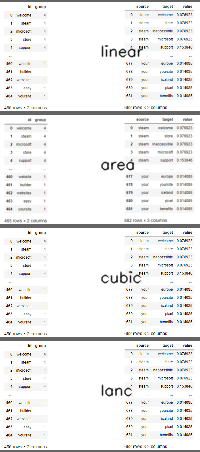

# Resize Image

---
- [Resize Image](#resize-image)
  - [Install & Operation](#install--operation)
  - [Outputs](#outputs)

## Install & Operation

Resize images with command-lines.

```shell
$ python resize.py -h

usage: resize.py [-h] [-f FILTER] [-d DIR] [-c] [-m METHOD] [-w WIDTH] [-v]

optional arguments:
  -h, --help            show this help message and exit
  -f FILTER, --filter FILTER
                        Filter file name
  -d DIR, --dir DIR     Directory to find images
  -c, --compare         Whether to compare interpolation methods
  -m METHOD, --method METHOD
                        Use what method to interpolate, options are ['linear', 'area', 'cubic', 'lanc'], only
                        available when compare is unset
  -w WIDTH, --width WIDTH
                        Width of the resized image
  -v, --verbose         Verbose
```

The terminal UI is


## Outputs

It resizes the image with different interpolation methods.
It turns out that the methods affect the quality more to the image with characters.

- Image-1




- Image-2


